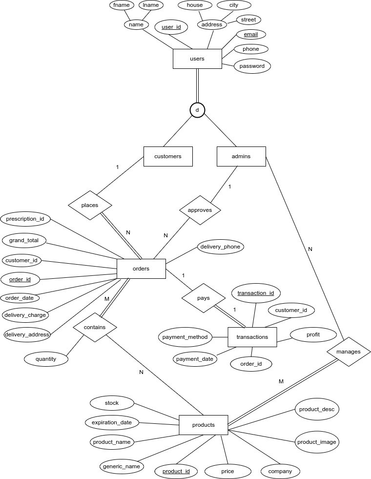
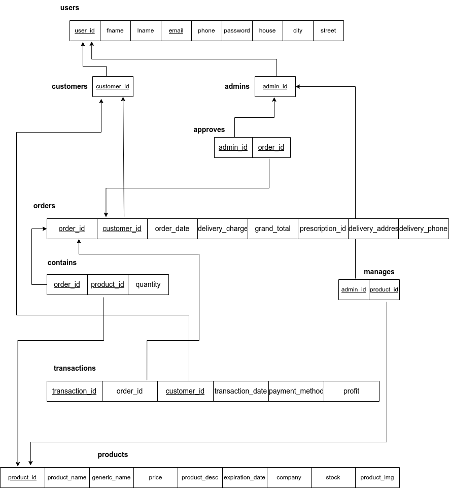
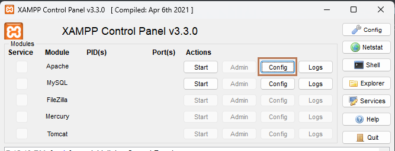

## DrugStore
---
CSE370 (Database Systems) lab group project.
### EER Diagram
---

### Schema Diagram
---


### How to run the server
---

#### For XAMPP in Windows:

1. First of all, download the whole file and place all of its contents (files and folders) inside the `htdocs` folder (caveat: if you have any other project in the `htdocs` you have to remove them). Note that, we are not using the downloaded folder instead we are placing all of the contents inside `htdocs` folder. The folder structure will be something like this.
```
htdocs/
├── assets
├── config
├── controllers
├── documents
├── images
├── index.php
├── quickmeds.sql
├── README.md
├── router.php
└── views
```

**Else**

You can also change the `Document Root` inside `Apache (httpd.conf)` file to achieve the aforementioned thing. To do that first open `XAMPP Control Panel` and click on the `config` button which is placed along with `apache`.



After clicking that you will see `Apache (httpd.conf)` and open that with any text editor. Now, find a snippet like this:

```
# DocumentRoot: The directory out of which you will serve your
# documents. By default, all requests are taken from this directory, but
# symbolic links and aliases may be used to point to other locations.
#
DocumentRoot "C:/xampp/htdocs"
<Directory "C:/xampp/htdocs">
    #
    # Possible values for the Options directive are "None", "All",
    # or any combination of:
    #   Indexes Includes FollowSymLinks SymLinksifOwnerMatch ExecCGI MultiViews
```

Change the folder path inside `DocumentRoot` and `Directory` to your desired folder path. That's it !!!

2. Import the `quickmeds.sql` file inside the database. Also, change the database info (password, username etc) in `config/db.php` if necessary.
3. After doing all that, just simply 'start' `Apache` and `MySQl` from `XAMPP Control Panel` and visit `localhost` in your browser.

#### For PHP_CLI in GNU/Linux:

1. First ensure that you have `php` installed. 

2. Import the `quickmeds.sql` file inside the database. Also, change the database info (password, username etc) in `config/db.php` if necessary.

3. Then go to the root directory and run this command to start the server

   ```
   php -S localhost:8080 .php_cli.php
   ```

4. Now visit `localhost:8080` in your favorite browser.

